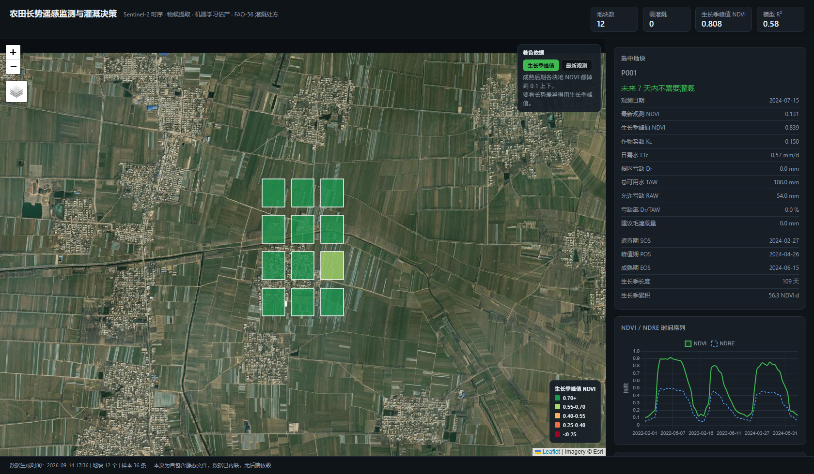

# 农田长势遥感监测与灌溉决策系统（实习 Demo 骨架）

技术主线：**Sentinel-2 时序 → 长势/物候 → 机器学习估产 → FAO-56 灌溉处方 → Web 地图展示**
全程跑在 GEE 免费额度内：重活（云掩膜、指数计算、时空聚合）在 GEE 上做，
本地只用 Python 做建模和决策，最后用一张地图 + 点击弹窗交付。



> 上图为 `python -m src.export_static` 导出的自包含页面（单文件 713 KB，gzip 后 151 KB）。
> 左侧地块按长势着色、可切换"生长季峰值/最新观测"，右侧是选中地块的 NDVI/NDRE 时序、
> 根区水分平衡曲线与灌溉处方，底部是模型精度与特征重要性。

---

## 1. 五段式技术路线（技术含量就在这里）

| 段 | 输入 | 处理 | 输出 | 含量标签 |
|---|---|---|---|---|
| ① 数据获取 | S2 SR + s2cloudless + SCL | 云/云影/卷云掩膜、反射率缩放、5 指数计算、地块级聚合 | `plot x date x index` 长表 | 遥感数据工程 |
| ② 时序重建 | 不规则、带云洞的时序 | 规则网格插值 + Savitzky-Golay 平滑 | 5 天步长 NDVI 曲线 | 时间序列分析 |
| ③ 物候提取 | 平滑曲线 | **动态阈值法**（非固定阈值） | SOS/POS/EOS/LOS/生长季积分 | 物候学 |
| ④ 建模 | 物候特征 + 实测值 | RandomForest + **按年分组交叉验证** | 产量预测 + 精度报告 | 机器学习 |
| ⑤ 决策 | ET0 + Kc + 土壤水分平衡 | FAO-56 双作物系数法 | **灌溉处方：哪天灌、灌多少 mm** | 农学 + 工程 |
| ⑥ 服务化 | 以上结果 | FastAPI + Leaflet | 可点击的地图 demo | 数据服务化 |

第 ②③ 段和第 ⑤ 段是这份骨架区别于"调库教程"的地方：
一个是把稀疏观测变成可用于建模的连续曲线，一个是把像素变成农民能执行的一句话。

---

## 2. 目录结构

```
agri-rs-demo/
├─ README.md
├─ requirements.txt
├─ .github/workflows/pages.yml     # push 即自动重建并发布到 GitHub Pages
├─ config/
│  ├─ config.yaml                  # 全部可调参数集中在这里，代码里不写魔法数字
│  └─ study_area.geojson           # 地块矢量，必须有 plot_id 字段
├─ gee/                            # 在 GEE Code Editor 里跑，导出到 Drive
│  ├─ 01_export_timeseries.js      # 地块级指数时序 -> CSV
│  ├─ 02_export_rasters.js         # 旬合成 NDVI 栅格 -> GeoTIFF（出图用）
│  └─ README.md                    # 怎么上传 Asset、常见报错
├─ src/
│  ├─ config.py                    # 配置加载（支持 a.b.c 点号路径）
│  ├─ io_utils.py                  # 读写、列名规范化、QC 过滤
│  ├─ timeseries.py                # ② 网格化 + S-G 平滑 + 双逻辑斯蒂拟合
│  ├─ phenology.py                 # ③ 动态阈值法物候参数
│  ├─ features.py                  # 特征组装（按"生长年"分组）
│  ├─ model.py                     # ④ RF + GroupKFold + 精度评价
│  ├─ et0.py                       # FAO-56 Penman-Monteith + NASA POWER
│  ├─ irrigation.py                # ⑤ Kc(NDVI) + 水分平衡 + 灌溉处方
│  ├─ pipeline.py                  # 一键串联 ②->⑤
│  └─ export_static.py             # 导出成自包含单文件 HTML（上线用）
├─ tools/
│  ├─ make_synthetic_data.py       # 生成合成数据，没数据也能先把管线跑通
│  ├─ selfcheck.py                 # 39 项离线自检（物理与数值预期）
│  ├─ fetch_vendor.py              # 抓 Leaflet/Chart.js 到本地，供内联
│  └─ check_static_page.py         # 用无头浏览器真渲染一遍静态页并断言
├─ app/
│  ├─ main.py                      # FastAPI（本地/在线服务形态）
│  ├─ static/index.html            # 在线服务版前端
│  ├─ static/static_template.html  # 静态页模板（导出时注入数据与依赖）
│  └─ static/vendor/               # 内联用的 Leaflet / Chart.js
├─ deploy/
│  ├─ README.md                    # 上线方案对比 + 逐步操作
│  ├─ Dockerfile                   # 静态版镜像（nginx，无 Python 运行时）
│  ├─ docker-compose.yml
│  └─ nginx.conf                   # gzip / 缓存 / 反向代理
├─ data/
│  ├─ raw/                         # GEE 导出 + 实测数据 + 气象缓存
│  ├─ interim/
│  └─ processed/                   # 特征表、预测、处方、Web 用 GeoJSON
├─ dist/                           # 导出的自包含页面（构建产物）
└─ reports/figures/                # 出图、答辩素材
```

---

## 3. 快速开始

### A. 先用合成数据把管线跑通（推荐，5 分钟）

```bash
# 国内直连 PyPI 很慢，建议走清华镜像
pip install -r requirements.txt -i https://pypi.tuna.tsinghua.edu.cn/simple

# 也可以把依赖装进项目内的 .deps（不占 C 盘，随时可删），用 PYTHONPATH 引入：
# pip install --target .deps -i https://pypi.tuna.tsinghua.edu.cn/simple \
#     scikit-learn scipy pyyaml fastapi "uvicorn[standard]"
# 然后每次运行前设置 PYTHONPATH=.deps

# 造一份 12 地块 x 3 年 的合成数据（同时生成 config/study_area.geojson）
python tools/make_synthetic_data.py

# 跑 39 项离线自检，确认 ET0 / 物候 / 水分平衡的数值都符合物理预期
python tools/selfcheck.py

# 一键跑完整管线（--skip-irrigation 可在没网时跳过气象拉取）
python -m src.pipeline

# 起服务看地图（独立进程，关掉终端也不会掉）
powershell -ExecutionPolicy Bypass -File tools/serve.ps1
# 打开 http://127.0.0.1:8000

# 停止服务
powershell -ExecutionPolicy Bypass -File tools/serve.ps1 -Stop
```

> 直接用 `uvicorn app.main:app --port 8000` 也行，但那样服务是当前终端的子进程，
> 终端一关服务就跟着死（退出码 0xC000013A）。`tools/serve.ps1` 用 `Start-Process`
> 把服务拉成独立进程，PID 记在 `.server.pid`，方便 `-Stop` 收尾。

# 导出成"一个文件"的自包含页面（推荐，用来发给人看）
python -m src.export_static
# 产物 dist/index.html，双击即可打开，不需要服务器
# 想上线请直接看第 8 节

# 校验静态页真的渲染正常（无头浏览器跑一遍）
python tools/check_static_page.py

### B. 接真实数据

1. **地块矢量**：把 `config/study_area.geojson` 换成你的，**必须带 `plot_id` 字段**，
   并把 `config.yaml` 里的 `study_area.lat / lon / elev_m` 改成研究区中心。
2. **跑 GEE**：Code Editor 里运行 `gee/01_export_timeseries.js`，
   Tasks 面板点 Run，导出到 Drive，下载 CSV 到 `data/raw/plot_timeseries.csv`。
3. **实测数据**：`data/raw/ground_truth.csv`，列至少为 `plot_id, year, <目标>`，
   目标列名要和 `config.yaml` 里的 `model.target` 一致（默认 `yield`）。
4. **跑管线**：`python -m src.pipeline`

---

## 4. 三个必须避开的坑（决定 demo 是"系统"还是"调库教程"）

1. **不要只出单时相 NDVI 图** —— 没有时间序列就没有"长势"这个概念，
   第 ②③ 段是含量的主要来源。
2. **不要用随机划分做交叉验证** —— 同一地块相邻年份高度自相关，随机划分会让
   训练集和验证集"见过几乎一样的样本"，R² 虚高 0.1~0.3。
   本骨架用 `GroupKFold(groups=year)`，并额外留出 `test_years` 做时间外推测试。
3. **不要在 GEE 里点一下就完事** —— 本地必须有可复现的管线，
   一条 `python -m src.pipeline` 就能从原始数据跑到灌溉处方。

---

## 5. 需要你确认或替换的东西

| 位置 | 现状 | 你要做的 |
|---|---|---|
| `config/study_area.geojson` | 12 个合成地块 | 换成真实地块，保留 `plot_id` |
| `study_area.lat/lon/elev_m` | 华北平原示例值 | 改成你的研究区 |
| `irrigation.kc_ndvi_a/b` | 文献经验值 1.457 / -0.1725 | **用本地实测标定后再用于生产** |
| `irrigation.field_capacity / wilting_point` | 0.30 / 0.12 | 换成你的土壤实测值 |
| `irrigation.root_zone_depth_mm` | 600 | 按作物根系深度调整 |
| `gee/02_export_rasters.js` 的 `crs` | EPSG:32650 | 按研究区 UTM 带号改 |
| `model.target` | `yield` | 改成 `lai` / `moisture` 或你的列名 |

---

## 6. 常见问题

**Q: 没有实测数据怎么办？**
A: 走**无监督路线**：对物候特征做时序聚类得到长势分级图，或者用重建曲线与实测曲线的
残差做异常检测。这两条路都不需要标签，第 ④ 段换成聚类即可。

**Q: NASA POWER 拉不到数据？**
A: 在 `config.yaml` 里把 `irrigation.et0_csv` 指向本地气象 CSV
（需要 `date, tmax, tmin, rh, u2, rs` 列，有 `rain` 更好），就能完全离线跑。

**Q: GEE 报 `User memory limit exceeded`？**
A: 拆成按年循环导出，或把 `reduceRegions` 的 `tileScale` 调大。

---

## 7. 已跑通的验证结果（合成数据，12 地块 x 3 年）

`python -m src.pipeline` 端到端跑通的实测输出：

| 环节 | 结果 |
|---|---|
| 原始观测 | 812 条 → 质量过滤后 811 条，12 地块，2022-02-01 ~ 2024-07-15 |
| 特征表 | 36 个 地块-年 x 34 列，全部判定为有作物 |
| 物候提取 | SOS 2/28~3/9，POS 4/22~5/2，EOS 6/15~7/5，LOS 98~126 天 |
| 交叉验证（按年分组） | R² = 0.58，RMSE = 0.085，nRMSE = 2.5% |
| 留出年测试（2024） | R² = 0.53，RMSE = 0.100 |
| Top 特征 | PHENO_amplitude、NDWI_min、PHENO_NDVI_integral、NDRE_max |
| 灌溉处方 | 77 条事件，全部落在生长季内，单次净灌溉 54~61 mm |
| Web 接口 | 10 个端点全部 200，中文 UTF-8 端到端校验通过 |

**注意**：这是合成数据上的数字，用于验证管线连通性，**不是真实精度声明**。
换成真实数据后精度会明显不同。

---

## 8. 上线：变成随时能打开的网址

完整方案对比与逐步操作在 `deploy/README.md`，这里只讲结论。

### 先分清两种形态

| 形态 | 产物 | 什么时候用 |
|---|---|---|
| **静态页**（推荐） | `dist/index.html`，一个文件，数据与前端库全部内联，**零后端** | 给人看、当作品集、发给面试官/导师 |
| 在线服务 | FastAPI 常驻进程 + `/api/*` | 需要实时重算、或要"系统"形态 |

关键判断：**数据是批处理产物**。跑一次管线结果就固定了，
这时静态页能提供完全一样的交互，却不需要服务器、不需要运维、不花钱。
先把静态页发出去，真有实时需求再考虑服务器。

### 三步上线（GitHub Pages）

```bash
# 1) 生成静态页
python -m src.export_static

# 2) 推仓库
git init && git add . && git commit -m "agri rs demo"
git branch -M main
git remote add origin https://github.com/<用户名>/<仓库名>.git
git push -u origin main

# 3) 推送（工作流已在 .github/workflows/pages.yml，不需要额外复制）
git push -u origin main
```

**然后在 GitHub 仓库 Settings → Pages → Build and deployment → Source 选 "GitHub Actions"**。
建议先开 Pages 再推，否则 deploy 环节会报"Pages 未启用"（build 是成功的，不影响正确性）。
之后每次 push 自动重跑管线 + 重新导出 + 发布，地址形如
`https://<用户名>.github.io/<仓库名>/`。

### 其他托管选项

| 方式 | 国内速度 | 成本 | 注意 |
|---|---|---|---|
| GitHub Pages | 一般，时有波动 | 免费 | 可挂 Cloudflare 代理加速 |
| Cloudflare Pages | 一般偏好 | 免费 | 构建命令见 `deploy/README.md` |
| 国内云服务器 + Nginx | **最快最稳** | 学生机几十~一百多/年 | **用 IP:端口访问不需要备案** |
| 阿里云 OSS / 腾讯云 COS | 快 | 便宜 | 默认域名访问 HTML 会被强制下载，需备案自有域名 |
| Vercel | 默认域名经常打不开 | 免费 | 不建议作为国内演示入口 |

云服务器一键起（`deploy/Dockerfile` 是 nginx 版静态镜像，运行时不需要 Python）：

```bash
docker build -f deploy/Dockerfile -t agri-rs-demo .
docker run -d --name agri-rs -p 8080:80 --restart unless-stopped agri-rs-demo
# 访问 http://<服务器IP>:8080
```

> `deploy/Dockerfile` 和 `deploy/docker-compose.yml` 已按标准写法给出，
> 但**本机没有装 Docker，没能实际构建验证**；其余部分都是跑通过验证的。

### 静态页的体积与依赖

- 单文件 **713 KB**，开启 gzip 后实际传输 **151 KB**（21%）
- 页面唯一的外部依赖是**地图瓦片**；瓦片挂了不影响地块着色、曲线和灌溉处方
  （数据和 Leaflet/Chart.js 都已内联）
- 页面左上角可在 Esri 影像 / CARTO 深色 / OSM 之间切换图层，哪个快用哪个
- 瓦片若长期不可用，可跑 `python tools/fetch_vendor.py` 重新抓依赖后再次导出

---

## 9. Demo 演示脚本（5 分钟）

1. 打开地图 → 地块按最新 NDVI 着色，一眼看出哪片长得差
2. 点一个长势差的地块 → 弹出 3 年 NDVI/NDRE 曲线
3. 同一面板往下看 → 根区亏缺曲线 + **灌溉处方："根区亏缺将在 N 天后触及允许亏缺，建议灌 X mm"**
4. 看右侧"模型精度"卡片 → 交叉验证 R² 与留出年 R² 分开列出
5. 收尾一句：从原始卫星影像到灌溉建议全自动，一条命令复现，36 项自检保证数值正确
